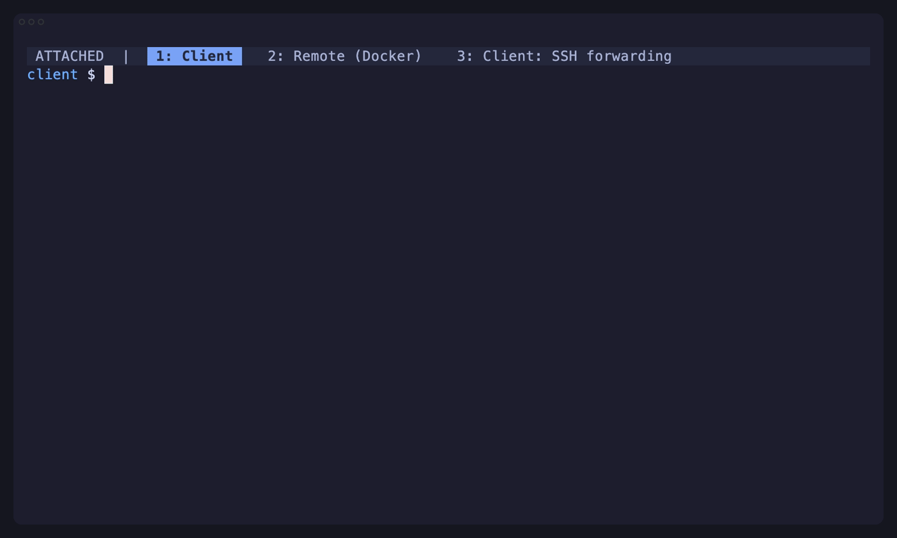

# Attached

Attach to remote Herdr session no matter where they run. No networking setup required!

## Demo

[Watch the full terminal demo (MP4)](demo/attached-demo.mp4) · [View the VHS tape](demo/attached-demo.tape)

## Session picker

Running `attached` without an explicit target opens an fzf session picker. Sessions are grouped by
host and the searchable rows show status, host, session name, and the last publish age. A green dot
marks a local session or a synchronized session published within the last three minutes; yellow
marks an older but still valid synchronized publication; white means publication-time metadata is
missing or beyond the allowed clock-skew window. Pass `HOST/SESSION` explicitly to skip the picker.
