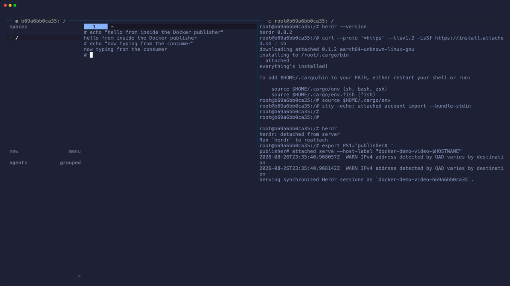

# Attached

Attach to remote Herdr session no matter where they run. No networking setup required!

## Demo

[Watch the full terminal demo (MP4)](demo/attached-demo.mp4) · [View the VHS tape](demo/attached-demo.tape)
