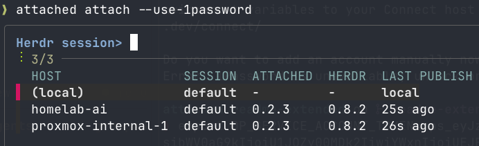

# Attached

Attach to remote Herdr sessions no matter where they run.

Attached uses secure peer-to-peer connections, together with a passive synchronization service,
to provide a safe way to attach to remote Herdr sessions without having to deal with any networking.
A good use case is attaching to ephemeral Herdr sessions spawned by AI agents running anywhere.

Watch the video below to see how to publish a session from a Docker container and connect to it from
the outside.


## Install

### Curl

```bash
curl --proto '=https' --tlsv1.2 -LsSf https://install.attached.sh | sh
```

### Cargo

```bash
cargo install --git https://github.com/pvalletbo/attached.git --locked attached
```

You can verify that Attached is correctly installed by running `attached --version`. Although not mandatory,
it is highly recommended to have [fzf](https://junegunn.github.io/fzf/)
installed as well for a better experience when attaching to remote sessions.

## Attaching to your first remote session

You must have two available hosts:

* **Client**: the local host from which you will control the remote session
* **Publisher**: the remote host serving a Herdr session to the client. This may be any kind of machine,
  as long as it can run Herdr (a Docker container works as well)

Both hosts must have Herdr installed. You can find the installation instructions
[here](https://herdr.dev/docs/install/).

```bash
# Client host
# Create an Attached account. No PII data is required.
# You will need to create a password to protect the files written locally.
attached account create
# Export the publisher-only credentials. They will be copied to your clipboard.
attached account export --type publish

# Publisher host
# On the publisher, start publishing its Herdr sessions.
# You will need to paste the publish-only bundle previously copied to the clipboard.
attached serve --host-label your-remote-session

# Back on the client, select and attach to the remote session.
attached attach
```

You should see something like the image below. Select the desired session, and you will be attached
to the remote Herdr session.



## How it works

To attach to remote Herdr sessions, a secure peer-to-peer (P2P) channel must be established. Instead of
implementing a custom solution to create this channel, Attached uses [Iroh](https://www.iroh.computer/)
under the hood to create P2P QUIC connections in which all transmitted bytes are end-to-end encrypted.
This means that no one except the two ends of the tunnel can read the commands sent between the Herdr
client and server.

To establish the tunnel, the client, which initiates the communication, must have enough information
to tell the server that it intends to start a tunnel. This is equivalent to knowing an IP address in a
regular HTTP message exchange. However, Iroh uses public keys instead of IP addresses because IP
addresses may change. Both the server and client have a public-private key pair used to secure the
tunnel. The server's public key is also used to perform an address lookup and determine how the server
can be reached over the Internet. Once this information is known, a NAT traversal ceremony attempts to
establish direct communication between the peers, using the cryptographic keys to secure the channel.
More information is available in the [Iroh documentation](https://docs.iroh.computer/concepts/endpoints).

Apart from sharing the Iroh connection details, the publisher and client need to share information
about the active Herdr sessions, such as the hostname and active session names. To share this information
securely, we rely on a backend service that stores the information in an encrypted form so that it can
never read or write the data. The publisher encrypts the information and pushes it to the server. The
client can then retrieve and decrypt it and start an attachment if active sessions are available. Among
other technical details, the following information is shared:

* **Host label**: a descriptive name for the host
* **Iroh endpoint ticket**: used by the consumer to establish the P2P tunnel
* **Attach capability**: a shared secret that the consumer must present to authorize the tunnel
* **Attached version**: the running version of the Attached binary
* **Herdr version**: the running version of Herdr
* **Sessions**: a list of the Herdr session names running on the remote machine

### Security model and limitations

If you want to know what things could go wrong, and how the Attached protects against different threats, 
do not skip this section. 

The following properties are guaranteed by the Attached's design if private and encryption 
keys are not leaked: 

* Communication between the Herdr client and server cannot be read by a third party

Protected by the end to end encryption provided by the Iroh quic tunnels.

* A malicious synchronization service cannot connect to remote Herdr sessions

Even though the synchronization service is used to share the connection details, the information 
is sent to the server encrypted using a symmetric key only known by the client and the publisher hosts. 
The symmetric key is shared using an out of bounds channel from the client to the publisher using 
the `attached export` command.

* A malicious synchronization service cannot lead the client to connect to remote sessions controlled by it

Because the connection details are encrypted and authenticated using symmetric encryption algorithm (XChaCha20-Poly1305)
and the service does not know the symmetric key, the client would not be able to decrypt the 
malicious connection details added by the rogue service. 

* A publisher host cannot connect to remote sessions

Even though the publisher hosts know the symmetric key used to encrypt the connection details, 
it is not able to fetch that information from the sync service because the API key possessed by it
only allows to upload information. The sync service must be trusted to verify the scope of the API 
key used to prevent malicious retrievals of connection details. 

* Local sensitive data is never stored in plain text

Both the client and publisher hosts need to store sensitive data, such as private and encryption keys. 
This information is never stored in plain text. Instead, the tool prompts the user to provide a password
that will be used to derive a local encryption key, or it will use [1Password](https://1password.com/)
to automatically generate a strong password. 

There are some limitations that must be understood before using the Attached cli. 

* The sync service may cause denial of service

Nothing prevents the synchronizaiton service to stop responding to the client, or to hide valid 
session details shared by the publisher. If this happens the client will not be able to connect 
to remote Herdr sesions. The sync service source code can be found in this repo so you are free to 
self host it if you feel like it. 

* Leaking client secrets may lead to RCE on hosts publishing Herdr sessions

If an attacker gains access to the secrets stored in the client machine, they will be able to 
connect to remote Herdr sessions meaning that they will get access to those hosts. Currently, 
there is no way to revoke or shut down sessions, so this is something to really take into account. 

## TODO

* Implement token revocation and sessions shut down in case of credentials leak
* Raycast support


